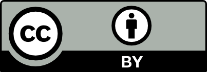

Overview
========

Copyright
---------

This documentation is protected by copyright.

With the exception of any material protected by trademark, all material included in this document is licensed under a `Creative Commons Attribution 3.0 Australia licence`_.

.. _Creative Commons Attribution 3.0 Australia licence: http://creativecommons.org/licenses/by/3.0/au/

The CC BY 3.0 AU Licence is a standard form license agreement that allows you to copy, distribute, transmit and adapt material in this publication provided that you attribute the work. Further details of the relevant licence conditions are available on the Creative Commons website (accessible using the links provided) as is the full legal code for the `CC BY 3.0 AU licence`_.

.. _CC BY 3.0 AU licence: http://creativecommons.org/licenses/by/3.0/au/legalcode

The form of attribution for any permitted use of any materials from this publication (and any material sourced from it) is:

Source: Licensed from the Commonwealth of Australia under a Creative Commons Attribution 3.0 Australia Licence. The Commonwealth of Australia does not necessarily endorse the content of this publication.

Introduction
------------

These are technical documents, they are only concerned with what and how. Specifics of who and when are contained in the git logs. This blog post explains why and where:

https://www.dto.gov.au/news-media/blog/making-government-discoverable

The user discovery later aims to provide useful features that enable users and 3rd party applications to discover government resources. It is currently in pre-ALPHA status, meaning a working technical assessment, not yet considered suitable for public use (even by "early-adopters").

.. graphviz::

   digraph d {
      node [shape="rectangle" style=filled fillcolor=white];
      rankdir=LR;

      pui [label="user\ninterface" shape=ellipse fillcolor=green];
      api [label="API" shape=ellipse fillcolor=green];
      
      subgraph cluster_app {
         label="discovery service"
	 worker;
	 nginx [label="reverse\nproxy"];
	 app [label="apps" shape=folder];
      }
      subgraph cluster_support {
         label="supporting tools";
	 crawler;
	 mt [label="metadata\nmanagement"];
      }
      
      pui -> nginx;
      api -> nginx;

      bs [label="backing\nservices" fillcolor=lightgrey];
      pub [label="public\ndata" shape=folder fillcolor=green];
      pub -> mt [dir=back];
      pub -> crawler [dir=back];
      pub -> worker [dir=back];
      crawler -> bs;
      nginx -> app -> bs;
      nginx -> bs;
      worker -> bs;
   }

TODO: define each box in the above diagram

Development
-----------

Discovery service:

 * http://github.com/AusDTO/discoveryLayer Code
 * http://github.com/AusDTO/discoveryLayer/issues Discussion
 * http://waffle.io/AusDTO/discoveryLayer Kanban
 * http://ausdto-discovery-layer.readthedocs.org/ Documentation

Crawler:

 * http://github.com/AusDTO/disco_crawler Code 
 * http://github.com/AusDTO/disco_crawler/issues Discussion
 * http://ausdto-disco-crawler.readthedocs.org/ Documentation

Metadata management (currently service catalogue):

 * http://github.com/AusDTO/serviceCatalogue Code 
 * http://github.com/AusDTO/serviceCatalogue/issues Discussion
 * http://ausdto-service-catalogue.readthedocs.org/ Documentation
